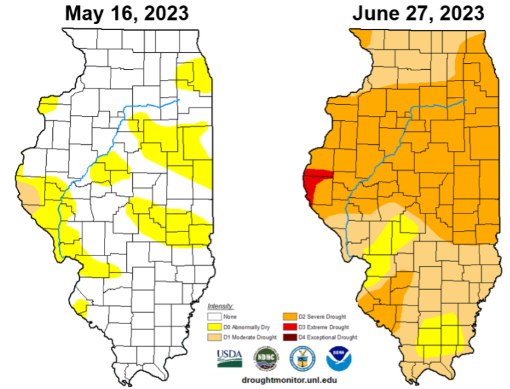
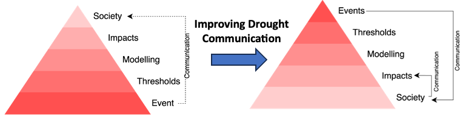

# What are the Agriculture Impacts of Flash Droughts in Illinois?

#### by: [Dr. Pedro Alencar](https://www.tu.berlin/oekohydro/team/pedro-alencar/) & [Dr. Trent Ford](https://stateclimatologist.web.illinois.edu/)
--------
You may have heard the term “flash drought” recently. A flash drought is a type of drought that develops and intensifies more quickly than a conventional drought. For example, much of central and western Illinois went from no drought in mid-May to severe or extreme drought in June this year. 

Flash drought is thought to cause worse impacts to agriculture because of its rapid development and relatively little time for preparation. However, flash droughts are challenging to identify, predict, and study. Therefore, the impacts specific to flash drought are not well understood and may be misrepresented in research. 

  
 
  <em> The US Drought Monitor showing drought intensification between May and June in Illinois </em>

We are working to better consider farmer and producer perception of drought, flash drought, and its impacts to improve drought monitoring and prediction. To help us develop this framework, we need to better understand what farmers consider to be an impact from drought, when those impacts occur, and how they affect farmer decision-making on season-to-season and longer timescales.

  
 
  <em> Improving drought communication requires condition and impact information flow from farmers and producers to scientists </em>

### To participate, answer a brief [questionnaire](https://forms.gle/MkzPchEotALNsNLQ6).

-------

#### Interested in learning more? Contact us:
- pedro.alencar@campus.tu-berlin.de
-	twford@illinois.edu

  

